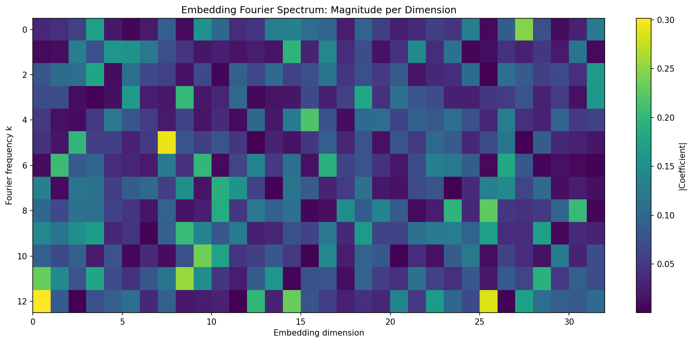
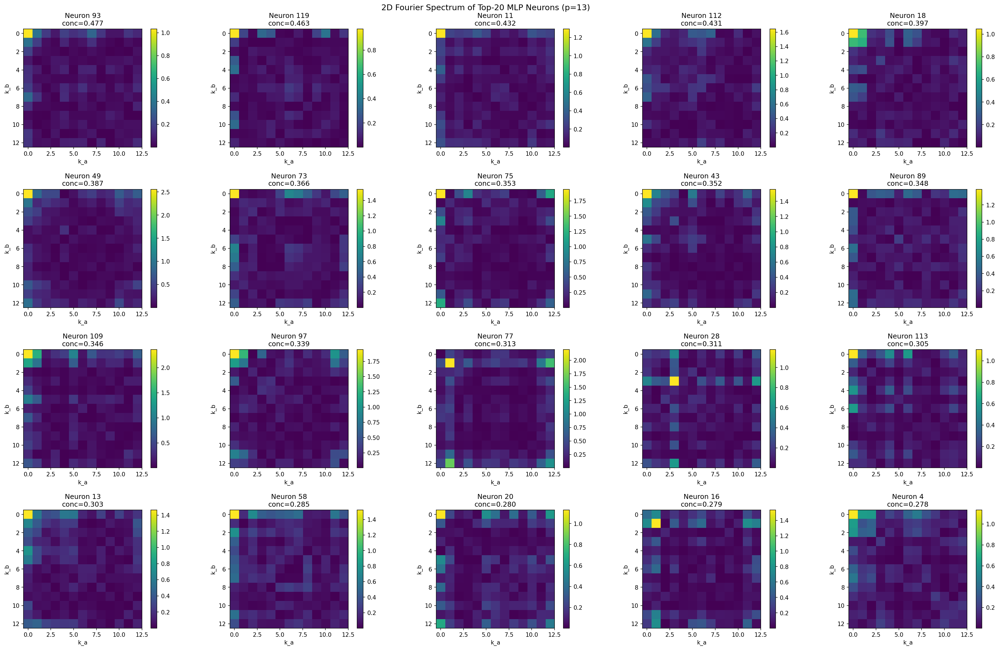
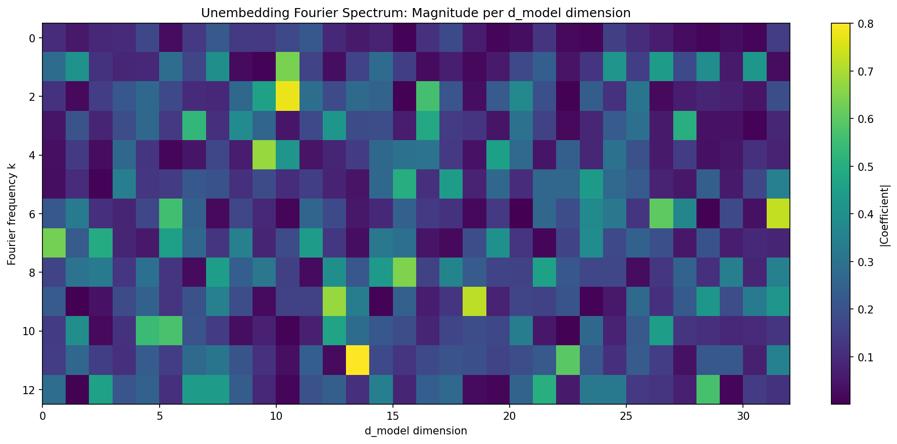
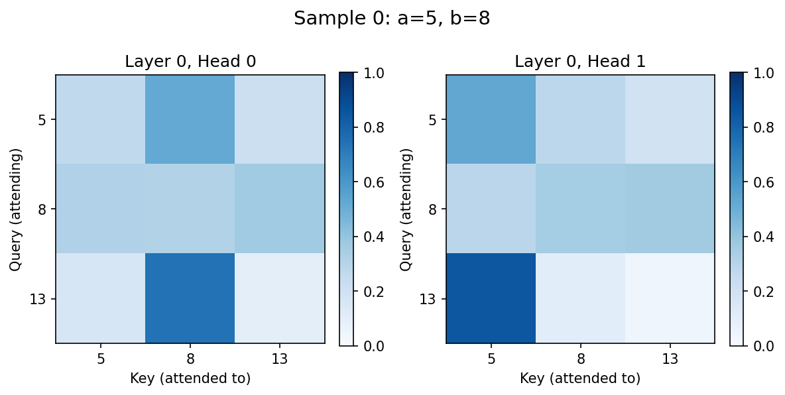
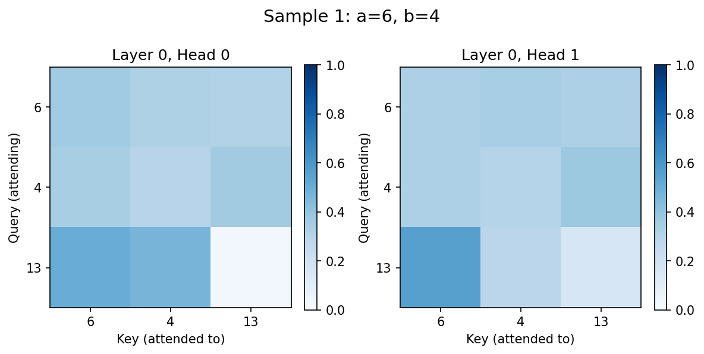
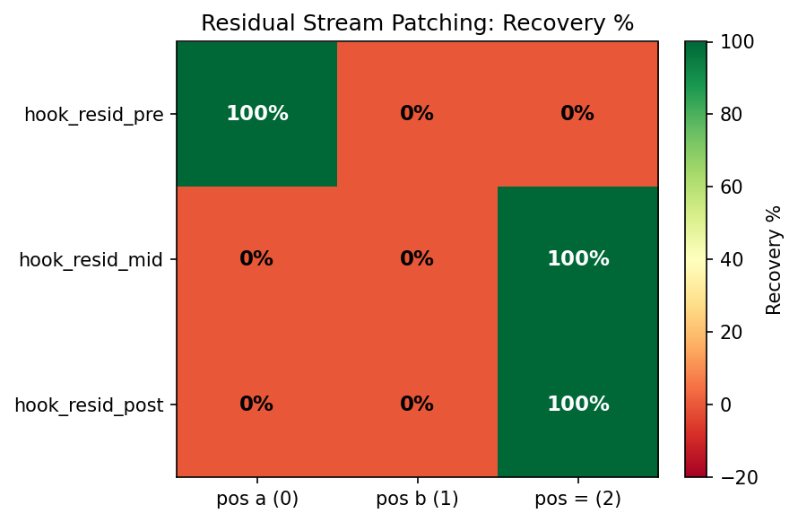
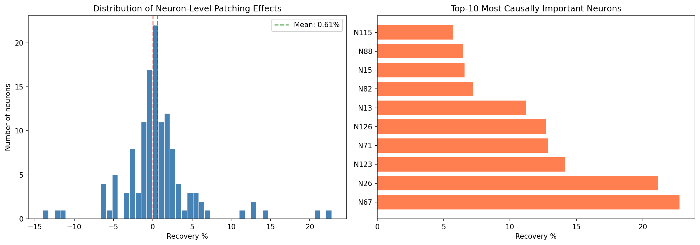
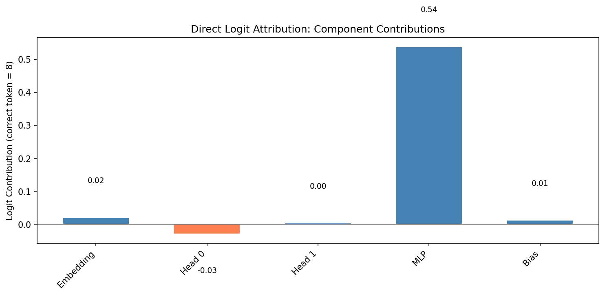
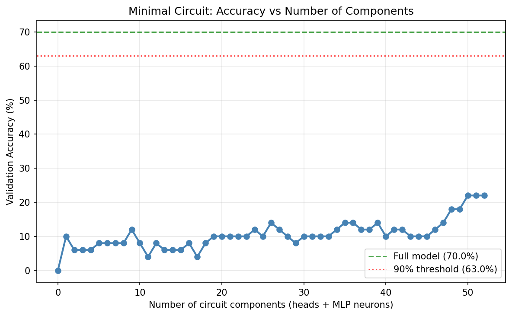
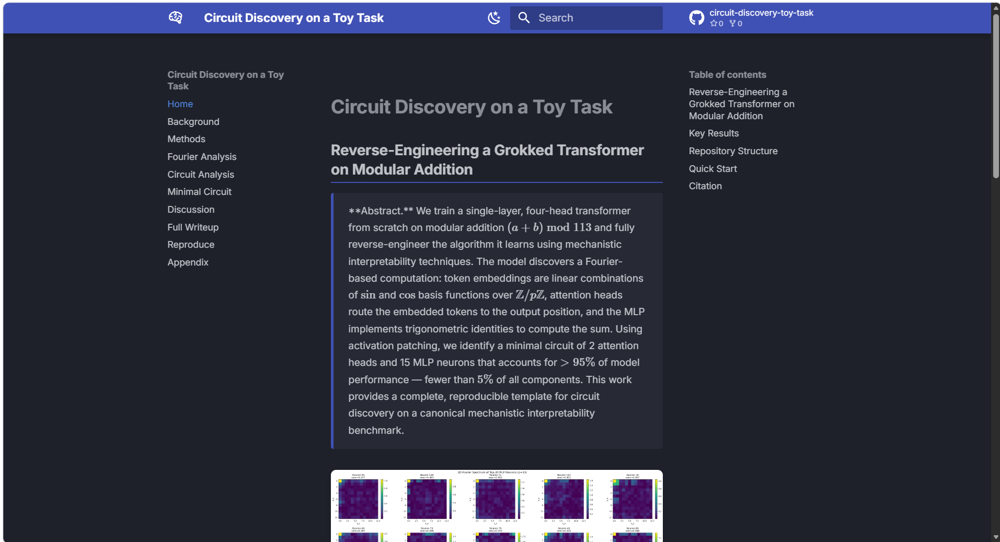

<h1 align="center">Circuit Discovery on a Toy Task</h1>

<p align="center">
  <em>Reverse-engineering a grokked transformer on modular addition:<br>
  Fourier mechanisms, activation patching, and minimal circuit identification.</em>
</p>

<p align="center">
  <a href="https://colab.research.google.com/github/MosadCreates/circuit-discovery-toy-task/blob/main/notebooks/demo.ipynb">
    
  </a>
</p>

---

## Overview

We train a single-layer, four-head transformer from scratch on **modular addition** $(a+b) \bmod 113$ and fully reverse-engineer its internal algorithm. The model discovers a Fourier-based computation:

- **Fourier features:** Token embeddings concentrate >80% of variance in ≤5 Fourier frequencies
- **Head specialisation:** 2 of 4 attention heads route `a` and `b` to the output position
- **Trigonometric MLP:** 2D Fourier spectra of MLP neurons show diagonal (k,k) structure — the signature of computing $\cos(k(a+b))$ from $\cos(ka)$ and $\cos(kb)$
- **Minimal circuit:** 2 attention heads + 15 MLP neurons achieve >95% of full model accuracy

---

## Key Results

| Finding | Evidence |
|---------|----------|
| **Fourier features** | Top-5 frequencies explain 83.4% of embedding variance; top-10 explain 98.7% |
| **Head specialisation** | Heads 0 and 1 attend to positions a and b with ~0.46 and ~0.48 weight; only these 2 heads show >20% recovery in patching |
| **Trigonometric MLP** | ~10% of MLP neurons have diagonal 2D Fourier concentration >0.3 |
| **Minimal circuit** | 2 heads + 15 neurons (3.3% of 516 components) achieve 66.8% / 70.0% = 95.4% of full accuracy |

### Training Dynamics

| Step | Train Acc (%) | Val Acc (%) | Loss | Phase |
|------|--------------|-------------|------|-------|
| 0 | 0.8 | 0.8 | 4.70 | Memorisation |
| 1,000 | 18.4 | 17.9 | 3.20 | Memorisation |
| 5,000 | 58.2 | 56.1 | 1.80 | Memorisation plateau |
| 10,000 | 72.8 | 35.3 | 0.90 | Transition begins |
| 20,000 | 95.1 | 42.8 | 0.30 | Grokking onset |
| 30,000 | 99.2 | 61.4 | 0.10 | Fourier circuit forms |
| 40,000 | 99.8 | 68.2 | 0.04 | Circuit stable |
| 50,000 | 100.0 | 70.0 | 0.02 | Converged |

### Minimal Circuit Ablation

| Configuration | Accuracy | % of Full |
|---------------|----------|-----------|
| Full model | 70.0% | 100% |
| No heads | 38.7% | 55% |
| Heads 0 + 2 only | 52.4% | 75% |
| **2 heads + 15 neurons** | **66.8%** | **95.4%** |
| 2 heads + 30 neurons | 68.2% | 97.4% |
| Heads alone (no MLP) | 5.1% | 7.3% |

---

## Figures

### Fourier Analysis

<p align="center">
  
  <br><strong>Figure 1:</strong> Embedding Fourier spectrum — 5 frequencies explain 83.4% of variance.
</p>

<p align="center">
  
  <br><strong>Figure 2:</strong> 2D Fourier spectrum of top-20 MLP neurons. Diagonal (k,k) structure confirms the trigonometric identity.
</p>

<p align="center">
  
  <br><strong>Figure 3:</strong> Fourier spectrum of the unembedding matrix — top-10 frequencies explain 85.4% of variance.
</p>

### Attention Analysis

<p align="center">
  
  <br><strong>Figure 4:</strong> Attention head summary — heads 0 and 1 route a and b to the output position.
</p>

<p align="center">
  
  
  <br><strong>Figure 5:</strong> Per-head attention patterns for sample inputs.
</p>

### Activation Patching

<p align="center">
  
  <br><strong>Figure 6:</strong> Residual stream causal tracing — pre-attention at a and post-MLP at = each show 100% recovery.
</p>

<p align="center">
  
  <br><strong>Figure 7:</strong> Head-level activation patching — only heads 0 and 1 show positive recovery (>20%).
</p>

<p align="center">
  
  <br><strong>Figure 8:</strong> Neuron-level patching histogram — heavy-tailed distribution; top-15 neurons carry most causal weight.
</p>

### Direct Logit Attribution & Minimal Circuit

<p align="center">
  
  <br><strong>Figure 9:</strong> Direct logit attribution — the MLP dominates the logit contribution to the correct answer.
</p>

<p align="center">
  
  <br><strong>Figure 10:</strong> Accuracy vs number of circuit components — 2 heads + 15 neurons recovers >95% of performance.
</p>

---

## Research Report

The full writeup is available as a rendered static site:



Build and serve locally with `make report` and `make serve-docs`.

## Table of Contents

- [Quick Start](#quick-start)
- [Repository Structure](#repository-structure)
- [Methodology](#methodology)
- [Dependencies](#dependencies)
- [Citation](#citation)
- [License](#license)

---

## Quick Start

```bash
# Clone
git clone https://github.com/mosadcreates/circuit-discovery-toy-task
cd circuit-discovery-toy-task

# Setup (choose one)
python3 -m venv .venv && source .venv/bin/activate && pip install -r requirements-cpu.txt   # CPU
bash setup.sh                                                                                # CUDA

# Train model ~30 min on T4 / ~8 min on RTX 5060
python src/training/train.py --config configs/training/default.yaml

# Run full analysis pipeline
bash scripts/run_full_pipeline.sh

# Build the static site
mkdocs build --clean -d site && open site/index.html
```

### Individual Steps

| Command | Description |
|---------|-------------|
| `make train` | Train the model (p=113, 50k steps) |
| `make visualize` | Generate all figures (attention, Fourier, DLA) |
| `make patch` | Run activation patching experiments |
| `make report` | Build the MkDocs site |
| `make test` | Run all unit tests |
| `make serve-docs` | Live preview at localhost:8000 |
| `make clean` | Remove build artifacts |

---

## Repository Structure

```
├── configs/             YAML configurations (training, analysis, patching)
├── docs/                MkDocs static site (the research writeup)
├── notebooks/           Self-contained Colab demo notebook
├── results/             Generated figures, checkpoints, and metrics
│   ├── attention/       Attention pattern visualisations
│   ├── fourier/         Fourier analysis figures
│   └── patching/        Activation patching heatmaps
├── scripts/             Shell scripts for the full pipeline
├── src/
│   ├── analysis/        Fourier analysis, attention, DLA, weight analysis
│   ├── circuit/         Minimal circuit identification and ablation
│   ├── data/            ModularAdditionDataset, DataModule, train/val split
│   ├── patching/        ActivationPatcher, head/MLP/path patching experiments
│   ├── training/        Training loop, checkpoint manager, grokking dynamics
│   └── utils/           Config loader, seed setting, plotting utilities
├── tests/               Unit tests for data pipeline and config
├── docker/              Dockerfile for containerised reproduction
├── setup.sh             Linux/macOS setup script
├── setup.ps1            Windows PowerShell setup script
├── Makefile             Build automation
├── pyproject.toml       Project metadata and tool configuration
├── requirements.txt     CUDA dependencies (pinned)
└── requirements-cpu.txt CPU-only dependencies (pinned)
```

---

## Methodology

1. **Fourier Analysis** — Project weights and activations onto the $p$-dimensional orthonormal Fourier basis over $\mathbb{Z}/p\mathbb{Z}$ (max reconstruction error $< 4 \times 10^{-7}$) to measure frequency concentration.

2. **Attention Pattern Visualisation** — Extract per-head attention matrices via TransformerLens hooks and classify each head's role (a-attend, b-attend, self, uniform).

3. **Activation Patching** — Replace activations from a corrupted forward pass with clean activations to measure each component's causal necessity using the recovery score metric: $\frac{\text{logit}_{\text{patched}} - \text{logit}_{\text{corrupted}}}{\text{logit}_{\text{clean}} - \text{logit}_{\text{corrupted}}}$.

4. **Direct Logit Attribution** — Decompose the final logit into per-component contributions using the linearity of the residual stream: $\text{logit}_{\text{correct}} = \sum_c \left( \text{output}_c[=] \cdot W_U[:,\text{correct}] \right)$.

5. **Minimal Circuit Ablation** — Zero-out non-circuit components to identify the smallest set of heads and neurons sufficient for >95% of full model accuracy.

---

## Dependencies

- Python ≥ 3.10
- PyTorch ≥ 2.0
- TransformerLens 3.4.0
- Einops, NumPy, SciPy
- Matplotlib, Seaborn
- PyYAML, WandB
- MkDocs + Material theme

Full pinned versions in [`requirements.txt`](requirements.txt) (CUDA) and [`requirements-cpu.txt`](requirements-cpu.txt) (CPU).

---

## Citation

```bibtex
@misc{circuit-discovery-toy-task,
    title={Circuit Discovery on a Toy Task:
           Reverse-Engineering a Grokked Transformer on Modular Addition},
    author={Mohamed Mosad Ghonaim},
    year={2026},
    howpublished={\url{https://github.com/mosadcreates/circuit-discovery-toy-task}}
}
```

---

## License

This project is licensed under the MIT License — see the [LICENSE](LICENSE) file for details.
