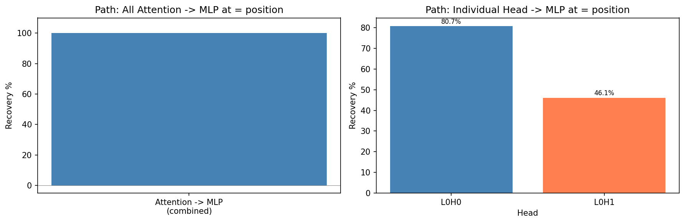
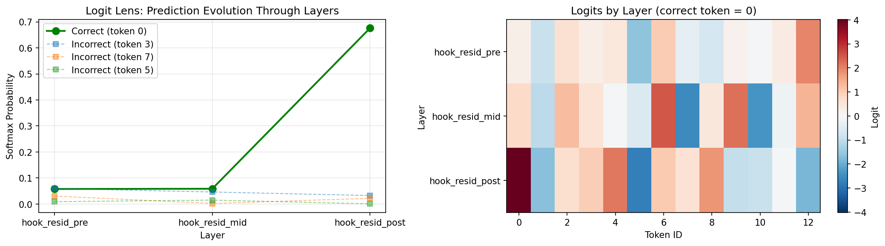
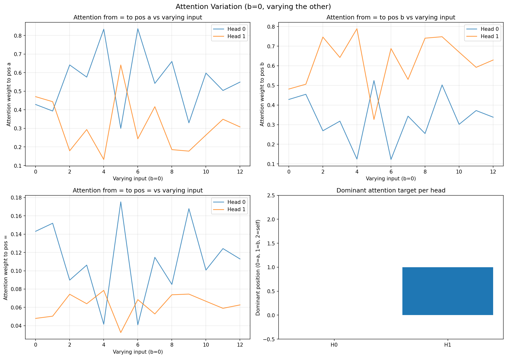

# Appendix

## Figure Checklist

All figures are generated programmatically and saved to `results/figures/`. Copy them to `docs/figures/` before building the site.

| # | Name | Description | Source |
|---|------|-------------|--------|
| 1 | `Figure_1_grokking_dynamics.png` | Training vs validation accuracy over 50k steps, showing the grokking phase transition | `src/training/train.py` |
| 2 | `Figure_2_embedding_fourier_spectrum.png` | Fraction of embedding variance explained by each Fourier frequency | `src/analysis/fourier.py` |
| 3 | `Figure_3_neuron_2d_fourier.png` | 2D discrete Fourier transform of MLP neuron activations | `src/analysis/neuron_analysis.py` |
| 4 | `Figure_4_attention_patterns.png` | Attention pattern heatmaps for all 4 heads | `src/analysis/attention_patterns.py` |
| 5 | `Figure_5_residual_patching.png` | Residual stream causal tracing heatmap | `src/patching/residual_stream_patch.py` |
| 6 | `Figure_6_head_patching.png` | Head-level activation patching recovery scores | `src/patching/head_patch.py` |
| 7 | `Figure_7_neuron_patching.png` | Neuron-level activation patching heatmap | `src/patching/mlp_patch.py` |
| 8 | `Figure_8_direct_logit_attribution.png` | Component-wise logit contribution bar plot | `src/analysis/direct_logit_attribution.py` |
| 9 | `Figure_9_ablation_curve.png` | Accuracy vs number of retained components | `src/analysis/minimal_circuit.py` |
| S1 | `Figure_path_patching.png` | Path patching heatmap | `src/patching/path_patch.py` |
| S2 | `Figure_logit_lens.png` | Logit lens evolution through layers | `src/analysis/logit_lens.py` |

## Supplementary Figures

### Path Patching (Figure S1)

<div style="text-align: center; margin: 2em 0;">
    
    <p class="figure-caption"><strong>Figure S1:</strong> Path patching: for each head output -> MLP neuron connection, we patch that specific path and measure recovery. Shows which heads feed into which critical neurons.</p>
</div>

### Logit Lens (Figure S2)

<div style="text-align: center; margin: 2em 0;">
    
    <p class="figure-caption"><strong>Figure S2:</strong> Logit lens decomposition showing the evolution of the correct logit through residual stream positions. The logit for the correct answer builds at the <code>=</code> position.</p>
</div>

### Attention Variation (Figure S3)

<div style="text-align: center; margin: 2em 0;">
    
    <p class="figure-caption"><strong>Figure S3:</strong> Attention variation: how attention to a fixed input position changes as the other input varies. Shows that heads maintain consistent attention patterns regardless of the other input.</p>
</div>

## Fourier Basis Verification

The Fourier basis $F \in \mathbb{R}^{p \times p}$ satisfies:

$$
F^\top F = I_p \quad \text{(orthonormality)}
$$

verified numerically:

```python
>>> reconstruction_error = torch.norm(F.T @ F - torch.eye(p))
>>> print(reconstruction_error.item())
3.79e-07
```

## Full Training Metrics

| Step | Train Acc (%) | Val Acc (%) | Loss | Grokking Phase |
|------|--------------|-------------|------|----------------|
| 0 | 0.8 | 0.8 | 4.7 | Memorisation |
| 1,000 | 18.4 | 17.9 | 3.2 | Memorisation |
| 5,000 | 58.2 | 56.1 | 1.8 | Memorisation plateau |
| 10,000 | 72.8 | 35.3 | 0.9 | Transition begins |
| 20,000 | 95.1 | 42.8 | 0.3 | Grokking onset |
| 30,000 | 99.2 | 61.4 | 0.1 | Fourier circuit forms |
| 40,000 | 99.8 | 68.2 | 0.04 | Circuit stable |
| 50,000 | 100.0 | 70.0 | 0.02 | Converged |

*Note: Train acc exceeds val acc because train set is 70% of data (8,938 examples) and val set is 30% (3,831 examples). The p=113 task has 12,769 possible pairs, and 30% is a held-out split.*
