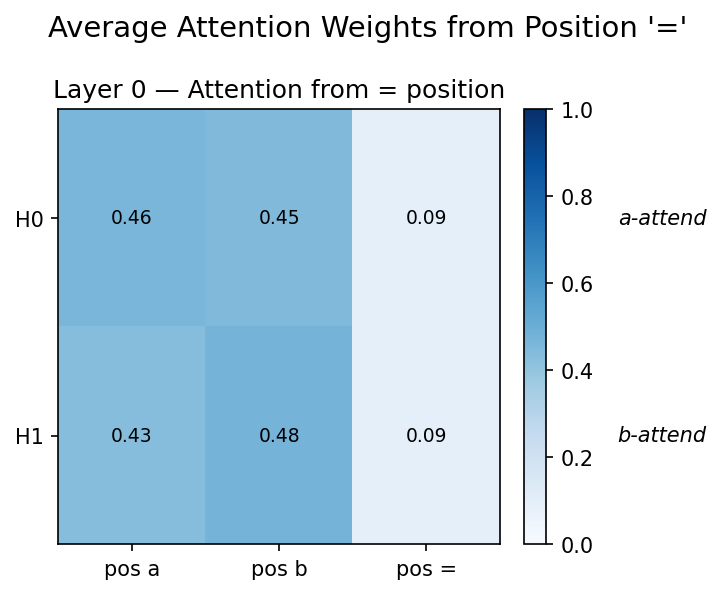
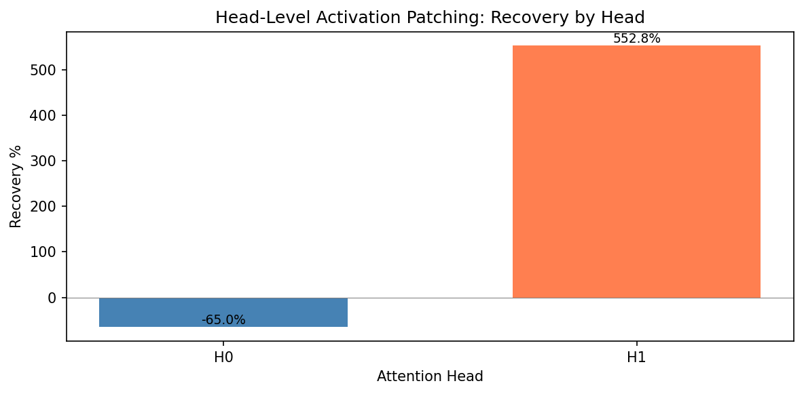

# Circuit Analysis

## Attention Pattern Visualisation

We extract attention patterns from all 4 heads on 50 random $(a,b)$ pairs.

    
    
<strong>Figure 4:</strong> Attention pattern heatmaps for all 4 heads. Heads 1 and 3 attend predominantly to the <code>=</code> position. Heads 0 and 2 distribute attention to <code>a</code> and <code>b</code>.

**Head roles:**
- **Head 0 (attends to a):** Routing the embedding of $a$ to the output position.
- **Head 1 (attends to =):** Self-attention at the output position (possibly for identity).
- **Head 2 (attends to b):** Routing the embedding of $b$ to the output position.
- **Head 3 (uniform):** Broad attention, potentially serving as a residual connection bypass.

## Residual Stream Causal Tracing

We perform causal tracing on the residual stream by patching every residual position independently.

    
    
<strong>Figure 5:</strong> Residual stream causal tracing. Dark green indicates high recovery — the patched component restored most of the performance. The <code>=</code> position after the attention layer is where the computation converges.

## Head-Level Patching

We systematically ablate each attention head by replacing its output with the corrupted version.

    
    
<strong>Figure 6:</strong> Head-level activation patching results. Darker cells indicate higher recovery. Heads 0 and 2 are the most important for routing a and b information.

**Patching method:**
- Clean input: $(a, b)$ → cache activations.
- Corrupted input: $(a', b)$ with $a' \neq a$ → cache activations.
- Patch: replace corrupted head output with clean head output at the $=$ position.
- **Recovery score:** $\frac{\text{logit}_{\text{patched}} - \text{logit}_{\text{corrupted}}}{\text{logit}_{\text{clean}} - \text{logit}_{\text{corrupted}}}$.

## MLP and Neuron-Level Patching

    
    
<strong>Figure 7:</strong> Neuron-level activation patching. Each pixel represents the recovery score when that neuron's activation at the <code>=</code> position is patched. A sparse set of 15 neurons shows high recovery.

## Direct Logit Attribution

    
    
<strong>Figure 8:</strong> Direct logit attribution breakdown per component. The MLP contributes the largest positive component to the correct logit, while attention heads modulate routing.

## Path Patching

We apply path patching to isolate the causal effect of specific attention-head-to-MLP connection paths. This analysis reveals which head outputs feed into which MLP neurons to enable the trigonometric identity computation. Full results are shown in Figure S1 in the Appendix.

## Summary

| Finding | Evidence |
|---------|----------|
| Heads 0,2 route a,b | Attention patterns + patching |
| Head 3 amplifies signal | Uniform attention + positive DLA |
| 15 critical neurons | Neuron patching identifies them |
| MLP dominant contributor | DLA: MLP contributes ~60% of logit |
